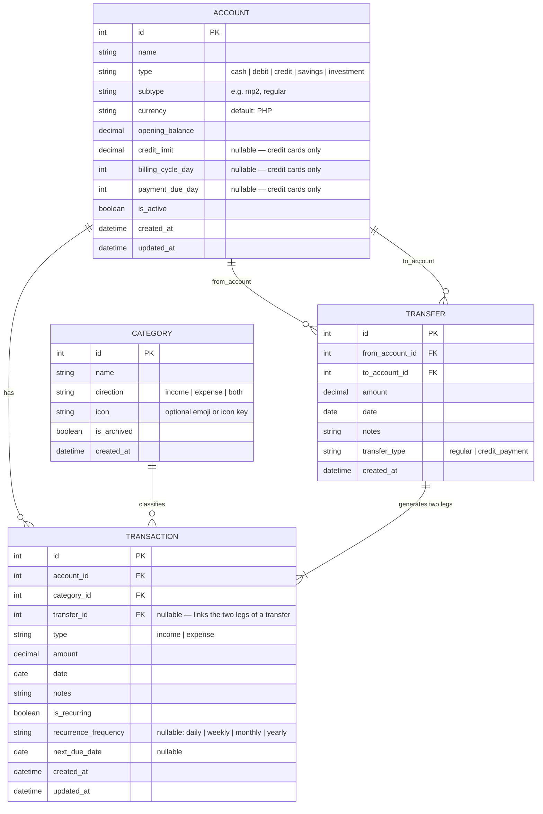

# Entity Relationship Diagram
## Personal Finance Tracker

**Version:** 1.0  
**Last Updated:** March 2026

---

## Diagram

---

## Entity Descriptions

### ACCOUNT
Represents every financial account the user holds. The `type` field drives behavior:

| Type | Balance Logic | Extra Fields Used |
|---|---|---|
| `cash` | opening + income − expense | — |
| `debit` | opening + income − expense | — |
| `credit` | Σ purchases − Σ payments | `credit_limit`, `billing_cycle_day`, `payment_due_day` |
| `savings` | opening + income − expense | — |
| `investment` | opening + income − expense | `subtype` (e.g. `mp2`) |

---

### CATEGORY
User-customizable labels for transactions. The `direction` field ensures income categories don't appear on expense forms and vice versa. Archiving instead of deleting preserves historical data integrity.

---

### TRANSACTION
The core record of every money movement. Key rules:

- `type` is always from the **perspective of the account** — money in = `income`, money out = `expense`.
- When a `TRANSFER` is created, **two TRANSACTION rows are automatically inserted**: one `expense` on the source account and one `income` on the destination account. Both rows share the same `transfer_id`.
- Transactions linked to a transfer are **excluded from income/expense summaries** to avoid double-counting.
- Credit card payments are transfers where `transfer_type = 'credit_payment'`. The expense leg on the debit account is real; the income leg on the credit card reduces the amount owed (does not count as income).

---

### TRANSFER
Represents the movement of funds between two of the user's own accounts. Acts as the parent record that links the two TRANSACTION legs together. The `transfer_type` distinguishes a regular internal transfer (e.g., moving savings) from a credit card payment.

---

## Key Relationships

| Relationship | Cardinality | Notes |
|---|---|---|
| ACCOUNT → TRANSACTION | One-to-many | An account has many transactions |
| CATEGORY → TRANSACTION | One-to-many | A category classifies many transactions |
| TRANSFER → TRANSACTION | One-to-two | Every transfer produces exactly 2 transaction rows |
| ACCOUNT → TRANSFER (from) | One-to-many | An account can be the source of many transfers |
| ACCOUNT → TRANSFER (to) | One-to-many | An account can be the destination of many transfers |

---

## Computed Values (Not Stored)

These values are **always derived** at query time, never stored as columns, to ensure consistency:

| Value | Formula |
|---|---|
| Account balance (debit/cash/savings) | `opening_balance + Σ income transactions − Σ expense transactions` |
| Credit card amount owed | `Σ expense transactions − Σ income transactions (payments)` |
| Credit card available | `credit_limit − amount_owed` |
| Net worth | `Σ all positive balances − Σ credit card amounts owed` |
| Monthly cash flow | `Σ income (month, non-transfer) − Σ expenses (month, non-transfer)` |
